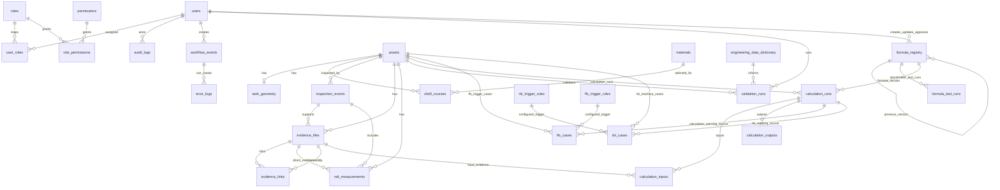
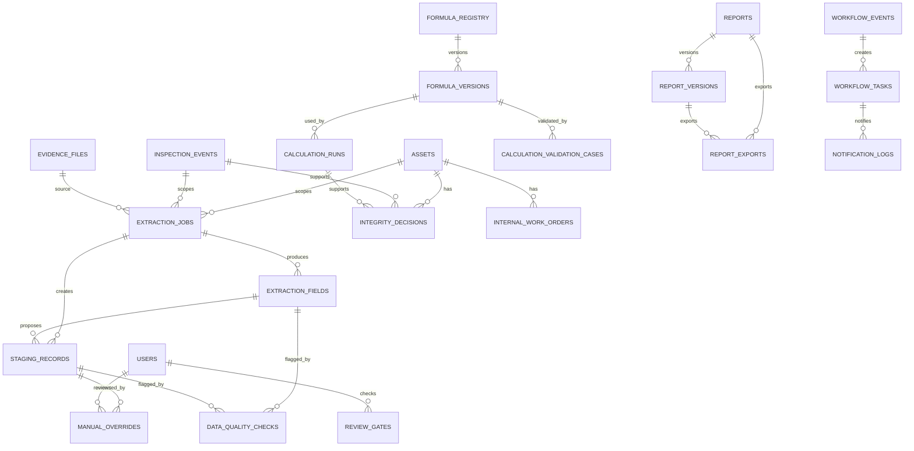
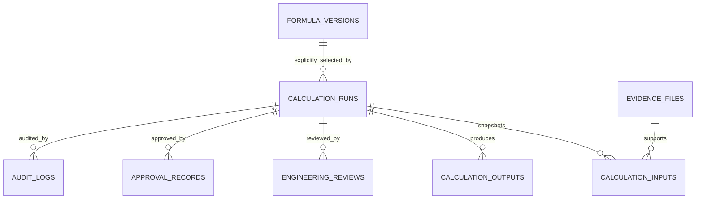

# AIM Tank Integrity ERD — Implemented Schema Through Phase 1.7 Closure



## Boundary

AIM/PostgreSQL stores final structured engineering data, metadata, validation snapshots, Formula Registry metadata, workflow events, error logs, and audit logs. n8n may create workflow events and error logs through AIM APIs only. Universal deterministic calculation execution is included through Sprint 6. FFS trigger workflow governance is included through Sprint 7. RBI interface workflow governance is included through Sprint 8. No API/API-ASME formula expression execution, FFS assessment calculation, quantitative API RP 581 calculation, AI extraction runtime, report generation, or CMMS work-order integration is included.

## Formula Registry Note

Formula Registry rows represent controlled metadata versions. Formula expressions for API-controlled logic must remain controlled placeholders until manually entered and approved by authorized engineers using licensed sources or approved fixtures. The required `formula_expression_source` field preserves formula source traceability.


## FFS Trigger Workflow Note

FFS cases are governance trigger records aligned to API 579-1/ASME FFS-1 workflow needs. They preserve trigger reason, supporting measurements, evidence snapshots, workflow status, and approval record linkage. They do not declare fitness for service or execute FFS calculations. Final disposition requires senior engineer/admin approval; AI agents cannot close cases.


## Sprint 8 RBI Interface

`rbi_cases` is implemented as an API RP 580/581 governance interface table. It links to `assets`, optionally to `inspection_events`, optionally to `calculation_runs`, and evidence through both JSON snapshot metadata and `evidence_links` rows with `linked_entity_type = 'rbi_case'`.

`rbi_trigger_rules` stores configurable trigger mappings from deterministic calculation warning codes or engineering review triggers to qualitative placeholder probability/consequence drivers and recommended inspection-plan actions.

No quantitative API RP 581 logic is represented in the ERD. Quantitative rules require future approved Formula Registry entries and a controlled executor.


## Sprint 9 Engineering Review and Approval Workflow

Implemented governance workflow for engineering reviews and senior engineer approval records. Review statuses are draft, submitted_for_review, returned_for_revision, reviewed, submitted_for_approval, approved, rejected, and locked. Engineer roles may review data and calculation results; senior_engineer/admin approval is required for final approval, rejection, override approval, and locking. AI agents cannot approve, reject, override, or finalize engineering decisions. Locked calculation/review/approval records are immutable; revisions must be created as new records.

Implemented tables/fields include engineering_reviews and approval_records extensions for calculation_run_id, asset_id, checklist_json, comments_json, override_json, reason, affected_field, original_value_json, override_value_json, evidence_links, revision_no, approval_status/review_status, approver/reviewer metadata, timestamps, locked_flag, and audit trail linkage.

Implemented APIs include GET/POST /api/v1/engineering/reviews, GET/PATCH/COMMENT /api/v1/engineering/reviews/{reviewId}, GET/POST /api/v1/approval-records, POST /api/v1/approval-records/{approvalId}/approve, POST /api/v1/approval-records/{approvalId}/reject, and GET /api/v1/engineering/calculations/{runId} for full calculation audit detail.

No API/API-ASME formulas, full API 579/API 581 quantitative calculation, external CMMS integration, or 3D processing are implemented in this sprint. Later governance phases implement AI extraction/staging, report generation/issue gates, and internal AIM work order fallback while AIM remains the system of record and n8n remains API-only orchestration.


## Sprint 10 Report Generation Tables

- `report_templates`: controlled report section/template metadata for tank integrity reports.
- `reports`: generated report records with version, status, calculation_run_id, asset_id, template_id, DOCX/PDF object paths, content hash, input snapshot hash, traceability JSON, evidence register JSON, validation warnings JSON, and locked/issued governance.

Relationships:
- `reports.asset_id` → `assets.id`
- `reports.calculation_run_id` → `calculation_runs.id`
- `reports.template_id` → `report_templates.id`
- Reports cite Formula Registry metadata through the linked calculation run.

## Phase 1.2 Source-of-Truth Schema Closure Addendum

Migration `0013_source_truth_schema_closure.sql` extends the logical ERD with the following relationship groups:



This addendum is schema readiness only. It preserves AIM as the system of record, n8n as orchestration-only, AI extraction as staging-only, and formula execution as deterministic/versioned/auditable through approved AIM metadata.

## Phase 1.3 Governance Batch Addendum

Additional Phase 1.3 relationships and controls:

- `extraction_jobs` 1--many `extraction_fields`.
- `extraction_jobs` 1--many `staging_records`.
- `extraction_fields` 1--many/optional `staging_records`.
- `staging_records` and `extraction_fields` may link to `manual_overrides` for human corrections.
- `data_quality_checks` may reference extraction job, extraction field, or staging record.
- `evidence_links` is the normalized linkage table for AI staging promotion evidence; evidence is not duplicated into final engineering records.
- `evidence_files` has signed URL access/audit metadata and malware scan placeholder status.
- Approval/report issue routes write to `audit_logs` and enforce RBAC, comments/reasons, and segregation-of-duty checks.

## Phase 1.4 OpenAPI and Contract Alignment Addendum

Phase 1.4 does not add new database tables or relationships. It reconciles the OpenAPI contract with the implemented route surface and the migrations already present through `0014_phase1_3_ai_evidence_approval_governance.sql`.

Contract metadata now explicitly maps implemented API paths to the existing ERD relationship groups:

- Auth/JWT endpoints map to `users`, `roles`, `permissions`, `user_roles`, `role_permissions`, `auth_refresh_sessions`, and `audit_logs`.
- AI extraction endpoints map to `extraction_jobs`, `extraction_fields`, `staging_records`, `manual_overrides`, `data_quality_checks`, `evidence_links`, and `audit_logs`.
- Evidence signed URL and delete governance endpoints map to `evidence_files`, `evidence_links`, and `audit_logs`.
- Approval and report issue endpoints map to `engineering_reviews`, `approval_records`, `reports`, `report_versions`, `review_gates`, `evidence_links`, and `audit_logs`.

The ERD remains unchanged for Phase 1.4. The alignment ensures OpenAPI carries the same source-of-truth boundary, staging-only AI extraction rule, human review rule, evidence linkage rule, and audit event rule that are already represented in the data dictionary and migrations.

## Phase 1.5 Calculation Governance ERD Addendum

Phase 1.5 extends calculation relationships without adding out-of-scope formulas or engineering standards logic.



New calculation run fields represented by this relationship layer are `formula_version_snapshot_json`, `output_snapshot_json`, `output_snapshot_hash`, `final_use_status`, `final_use_disclaimer`, and `final_use_blockers_json`.

The ERD remains bounded to deterministic MVP formula fixtures and approved Formula Registry/version metadata. Calculation final use is blocked until evidence, review, approval, and warning gates pass. The mandatory disclaimer remains: `Engineering review required before final use.`

## Phase 1.6 Addendum — Report Issue Gates and Internal Work Order Fallback

No external CMMS system is introduced in Phase 1.6. AIM remains the system of record.

### Updated logical relationships

- `reports` stores issue gate status and gate checklist snapshots.
- `review_gates` stores report issue gate evaluations using `gate_domain = 'report_issue'`.
- `internal_work_orders` links to `assets`, optional `inspection_events`, optional `integrity_decisions`, and optional `reports`.
- `internal_work_orders.gate_checklist_json` records whether the work order source was an approved integrity decision, issued report action, or explicit preliminary internal control.
- `evidence_links` may link closure evidence to `internal_work_order` records and must directly link evidence to integrity decisions before approval and to report/calculation/integrity-decision entities before final report issue.
- `audit_logs` records all report issue, blocked issue, work order creation, update, blocked close, and close events.
- `error_logs` records report issue gate blockage where applicable.

### Phase 1.6 boundary

- Report issue is human-only and gate-checked.
- AI cannot issue reports.
- n8n/service users cannot issue reports directly.
- Internal work orders are AIM fallback records only.
- `external_cmms_reference` remains nullable and is not populated by Phase 1.6 routes.
- No API 579/API 581/CMMS/3D implementation is introduced.


## Phase 1.7 Addendum — Final Source-of-Truth Reconciliation

Phase 1.7 does not add a new database module. It records final reconciliation coverage for the Phase 1 Governance Closure scope.

The following source-of-truth entities are represented by migrations `0012` through `0016`, the data dictionary, and this ERD/addendum trail:

- `extraction_jobs`
- `extraction_fields`
- `staging_records`
- `manual_overrides`
- `data_quality_checks`
- `integrity_decisions`
- `review_gates`
- `internal_work_orders`
- `report_versions`
- `report_exports`
- `workflow_tasks`
- `notification_logs`
- `system_settings`
- `calculation_validation_cases`
- `formula_versions`

Phase 1.7 also confirms the boundary relationships remain unchanged: AI extraction is staging-only; calculation execution is deterministic, versioned, audited, and evidence-gated; report issue is human-only and gate-checked; internal work orders are AIM fallback records only; and no external SAP/Maximo/CMMS, full API 579, full API 581, 3D processing, frontend UI, or invented API/ASME formulas are introduced.


## UAT Cycle 1 Release Hardening Addendum

- `approval_records.created_at` is part of the approval record audit timeline.
- `approval_records.approved_at` is nullable and represents actual approval time only.
- Integrity decision approval is evidence-gated through `evidence_links(linked_entity_type = 'integrity_decision')`.
- Report issue is evidence-gated per entity: `report`, `calculation_run`, and approved `integrity_decision` must each have direct evidence linkage.
- Prior report issue gate-blocked `error_logs` remain auditable and are marked `resolved` when the report is successfully issued.
- Internal AIM work orders remain the MVP fallback before any future external CMMS integration.

## RC2 Governance Gate Reconciliation

Evidence lineage for final report issue now requires three direct evidence link relationships:

```text
reports.id <- evidence_links(linked_entity_type = 'report')
calculation_runs.id <- evidence_links(linked_entity_type = 'calculation_run')
integrity_decisions.id <- evidence_links(linked_entity_type = 'integrity_decision')
```

Integrity decision approval is blocked until direct integrity-decision evidence exists. Internal work orders may be generated from issued reports or approved integrity decisions and remain inside AIM; External CMMS is out of MVP scope.
