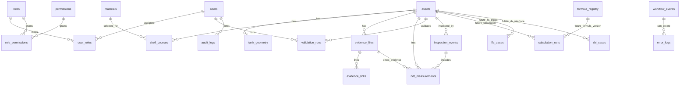
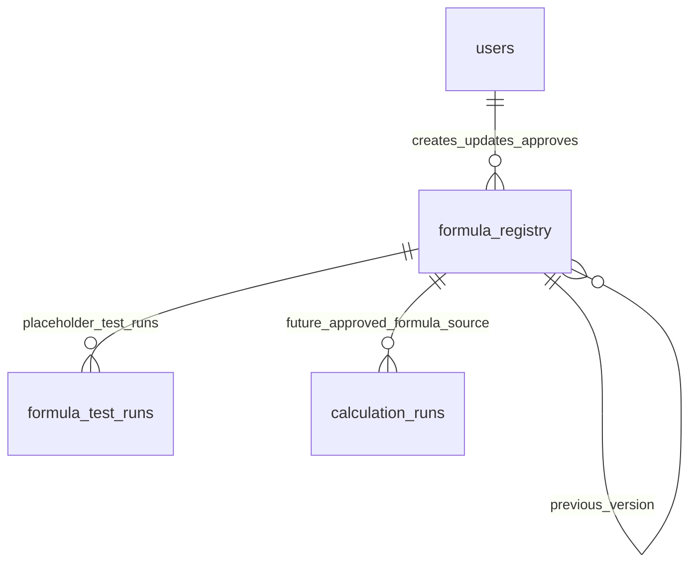

# AIM Tank Integrity ERD — Current Implemented Schema

## Boundary

AIM/PostgreSQL stores final structured engineering data and validation snapshots. n8n may create workflow events and error logs through AIM APIs only. No engineering formula execution, AI extraction runtime, or report generation is included in Sprint 4.

## Sprint 5 Formula Registry Addendum

Formula Registry rows represent controlled metadata versions. Formula expressions for API-controlled logic must remain controlled placeholders until manually entered and approved by authorized engineers using licensed sources or approved fixtures.
