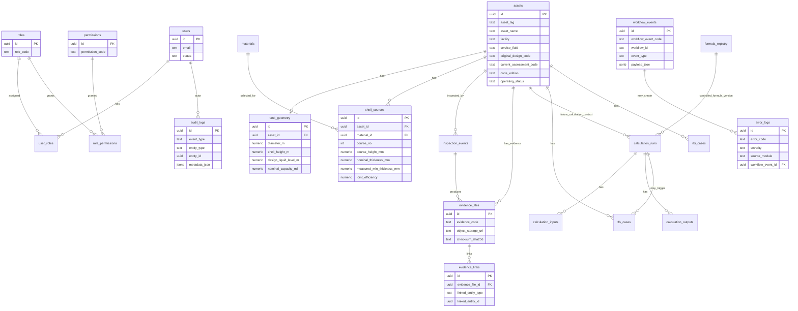

# AIM Tank Integrity ERD — Current Implemented Schema

## Future / Planned ERD Extension

Sprint 3+ will add functional NDT measurement tables and evidence upload APIs. AI extraction, calculation execution, report generation, and external CMMS integration remain future/planned and must preserve AIM/n8n boundaries.
