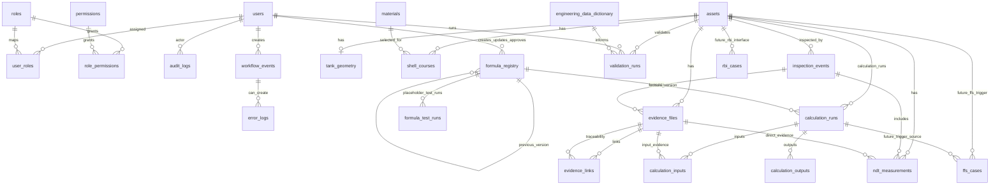

# AIM Tank Integrity ERD — Implemented Schema Through Sprint 5.5

## Boundary

AIM/PostgreSQL stores final structured engineering data, metadata, validation snapshots, Formula Registry metadata, workflow events, error logs, and audit logs. n8n may create workflow events and error logs through AIM APIs only. Universal deterministic calculation execution is included through Sprint 6. No API/API-ASME formula expression execution, AI extraction runtime, report generation, or CMMS work-order integration is included.

## Formula Registry Note

Formula Registry rows represent controlled metadata versions. Formula expressions for API-controlled logic must remain controlled placeholders until manually entered and approved by authorized engineers using licensed sources or approved fixtures. The required `formula_expression_source` field preserves formula source traceability.
