# AIM+n8n MVP ERD

This ERD is the logical MVP database model. AIM/PostgreSQL is the system of record. n8n is represented only through workflow/event references and must not write final engineering data directly.

```mermaid
erDiagram
  USERS {
    uuid user_id "PK"
    varchar email
    varchar full_name
    varchar account_status
  }
  ROLES {
    uuid role_id "PK"
    varchar role_code
    varchar role_name
  }
  PERMISSIONS {
    uuid permission_id "PK"
    varchar permission_code
    varchar module
    varchar action
  }
  USER_ROLES {
    uuid user_id "PK, FK"
    uuid role_id "PK, FK"
    varchar status
  }
  ROLE_PERMISSIONS {
    uuid role_id "PK, FK"
    uuid permission_id "PK, FK"
    varchar status
  }
  ASSETS {
    uuid asset_id "PK"
    varchar asset_tag
    varchar asset_type
    varchar asset_status
  }
  ASSET_COMPONENTS {
    uuid component_id "PK"
    uuid asset_id "FK"
    varchar component_type
    integer course_no
  }
  INSPECTIONS {
    uuid inspection_id "PK"
    uuid asset_id "FK"
    varchar inspection_code
    varchar inspection_status
  }
  INSPECTION_FINDINGS {
    uuid finding_id "PK"
    uuid inspection_id "FK"
    uuid component_id "FK"
    varchar finding_type
    varchar review_status
  }
  EVIDENCE_FILES {
    uuid evidence_file_id "PK"
    text storage_uri
    varchar file_type
    varchar evidence_status
  }
  EVIDENCE_LINKS {
    uuid evidence_link_id "PK"
    uuid evidence_file_id "FK"
    varchar entity_type
    uuid entity_id
    varchar evidence_code
  }
  EXTRACTION_JOBS {
    uuid extraction_job_id "PK"
    uuid inspection_id "FK"
    uuid evidence_file_id "FK"
    varchar job_status
  }
  EXTRACTION_FIELDS {
    uuid extraction_field_id "PK"
    uuid extraction_job_id "FK"
    varchar field_key
    numeric confidence_score
    varchar review_status
  }
  STAGING_RECORDS {
    uuid staging_record_id "PK"
    uuid extraction_job_id "FK"
    varchar target_table_name
    varchar review_status
  }
  MANUAL_OVERRIDES {
    uuid override_id "PK"
    uuid staging_record_id "FK"
    text corrected_value
    varchar reason_code
  }
  DATA_QUALITY_CHECKS {
    uuid quality_check_id "PK"
    uuid staging_record_id "FK"
    varchar check_type
    varchar check_status
    varchar severity
  }
  NDT_MEASUREMENTS {
    uuid measurement_id "PK"
    uuid inspection_id "FK"
    uuid asset_id "FK"
    varchar method_type
    varchar dataset_status
  }
  CML_POINTS {
    uuid cml_point_id "PK"
    uuid asset_id "FK"
    uuid component_id "FK"
    varchar cml_code
  }
  THICKNESS_READINGS {
    uuid reading_id "PK"
    uuid measurement_id "FK"
    uuid cml_point_id "FK"
    numeric current_thickness_mm
    numeric minimum_required_thickness_mm
  }
  FORMULA_VERSIONS {
    uuid formula_version_id "PK"
    varchar formula_code
    varchar version_no
    varchar approved_status
  }
  CALCULATION_RUNS {
    uuid calculation_run_id "PK"
    uuid asset_id "FK"
    uuid inspection_id "FK"
    uuid formula_version_id "FK"
    varchar run_status
  }
  CALCULATION_INPUTS {
    uuid calculation_input_id "PK"
    uuid calculation_run_id "FK"
    varchar input_key
    numeric input_value_numeric
    uuid evidence_link_id "FK"
  }
  CALCULATION_OUTPUTS {
    uuid calculation_output_id "PK"
    uuid calculation_run_id "FK"
    varchar output_key
    varchar status_result
    uuid evidence_link_id "FK"
  }
  CALCULATION_VALIDATION_CASES {
    uuid validation_case_id "PK"
    uuid formula_version_id "FK"
    varchar test_case_id
    varchar pass_fail
  }
  INTEGRITY_DECISIONS {
    uuid decision_id "PK"
    uuid asset_id "FK"
    uuid inspection_id "FK"
    uuid calculation_run_id "FK"
    varchar decision_status
  }
  REPORTS {
    uuid report_id "PK"
    uuid asset_id "FK"
    uuid inspection_id "FK"
    uuid report_template_id "FK"
    uuid current_version_id "FK"
    varchar report_status
  }
  REPORT_TEMPLATES {
    uuid report_template_id "PK"
    varchar template_code
    varchar template_version
    varchar template_status
  }
  REPORT_VERSIONS {
    uuid report_version_id "PK"
    uuid report_id "FK"
    integer version_no
    varchar approval_status
  }
  WORKFLOW_EVENTS {
    uuid workflow_event_id "PK"
    varchar source_system
    varchar event_type
    varchar entity_type
    uuid entity_id
  }
  WORKFLOW_TASKS {
    uuid workflow_task_id "PK"
    varchar task_type
    varchar entity_type
    uuid entity_id
    uuid assigned_to "FK"
  }
  NOTIFICATION_LOGS {
    uuid notification_id "PK"
    uuid recipient_user_id "FK"
    varchar channel
    varchar delivery_status
  }
  ERROR_LOGS {
    uuid error_id "PK"
    varchar source_system
    varchar severity
    varchar error_code
  }
  AUDIT_LOGS {
    uuid audit_log_id "PK"
    uuid actor_user_id "FK"
    varchar action_type
    varchar entity_type
    uuid entity_id
  }
  IMPORT_BATCHES {
    uuid import_batch_id "PK"
    uuid source_file_id "FK"
    varchar source_type
    varchar import_status
  }
  SYSTEM_SETTINGS {
    uuid setting_id "PK"
    varchar setting_key
    text setting_value
    varchar setting_scope
  }
  INTERNAL_WORK_ORDERS {
    uuid work_order_id "PK"
    uuid asset_id "FK"
    uuid inspection_id "FK"
    uuid decision_id "FK"
    varchar work_order_status
  }

  USERS ||--o{ USER_ROLES : assigned
  ROLES ||--o{ USER_ROLES : assigned_to
  ROLES ||--o{ ROLE_PERMISSIONS : grants
  PERMISSIONS ||--o{ ROLE_PERMISSIONS : granted_to
  ASSETS ||--o{ ASSET_COMPONENTS : has
  ASSETS ||--o{ INSPECTIONS : inspected_by
  INSPECTIONS ||--o{ INSPECTION_FINDINGS : has
  ASSET_COMPONENTS ||--o{ INSPECTION_FINDINGS : observed_on
  EVIDENCE_FILES ||--o{ EVIDENCE_LINKS : referenced_by
  INSPECTIONS ||--o{ EXTRACTION_JOBS : triggers
  EVIDENCE_FILES ||--o{ EXTRACTION_JOBS : source_for
  EXTRACTION_JOBS ||--o{ EXTRACTION_FIELDS : returns
  EXTRACTION_JOBS ||--o{ STAGING_RECORDS : proposes
  STAGING_RECORDS ||--o{ MANUAL_OVERRIDES : corrected_by
  STAGING_RECORDS ||--o{ DATA_QUALITY_CHECKS : checked_by
  INSPECTIONS ||--o{ NDT_MEASUREMENTS : includes
  ASSETS ||--o{ NDT_MEASUREMENTS : measured
  ASSET_COMPONENTS ||--o{ NDT_MEASUREMENTS : measured_component
  ASSETS ||--o{ CML_POINTS : has
  ASSET_COMPONENTS ||--o{ CML_POINTS : has
  NDT_MEASUREMENTS ||--o{ THICKNESS_READINGS : contains
  CML_POINTS ||--o{ THICKNESS_READINGS : measured_at
  FORMULA_VERSIONS ||--o{ CALCULATION_RUNS : used_by
  ASSETS ||--o{ CALCULATION_RUNS : calculated_for
  INSPECTIONS ||--o{ CALCULATION_RUNS : basis_for
  CALCULATION_RUNS ||--o{ CALCULATION_INPUTS : has
  CALCULATION_RUNS ||--o{ CALCULATION_OUTPUTS : produces
  FORMULA_VERSIONS ||--o{ CALCULATION_VALIDATION_CASES : validates
  ASSETS ||--o{ INTEGRITY_DECISIONS : decision_for
  INSPECTIONS ||--o{ INTEGRITY_DECISIONS : basis_for
  CALCULATION_RUNS o|--o{ INTEGRITY_DECISIONS : informs
  ASSETS ||--o{ REPORTS : reported_in
  INSPECTIONS ||--o{ REPORTS : reported_in
  REPORT_TEMPLATES ||--o{ REPORTS : uses
  REPORTS ||--o{ REPORT_VERSIONS : versions
  USERS ||--o{ WORKFLOW_TASKS : assigned
  USERS ||--o{ NOTIFICATION_LOGS : receives
  USERS o|--o{ AUDIT_LOGS : acts
  EVIDENCE_FILES o|--o{ IMPORT_BATCHES : imported_from
  ASSETS ||--o{ INTERNAL_WORK_ORDERS : has
  INSPECTIONS o|--o{ INTERNAL_WORK_ORDERS : generates
  INSPECTION_FINDINGS o|--o{ INTERNAL_WORK_ORDERS : generates
  INTEGRITY_DECISIONS o|--o{ INTERNAL_WORK_ORDERS : generates
```

## Polymorphic Evidence and Workflow Links

- `evidence_links.entity_type + entity_id` is intentionally polymorphic to support evidence attachment to findings, readings, calculation inputs/outputs, integrity decisions, report versions, and internal work orders.
- `workflow_events.entity_type + entity_id` and `workflow_tasks.entity_type + entity_id` are also polymorphic orchestration links.
- These links should be validated by application services and covered by integration tests because PostgreSQL cannot enforce a conventional FK across polymorphic targets without additional design patterns.

## AIM/n8n Boundary

- AIM emits `workflow_events` for n8n to orchestrate reminders, approvals, notifications, and integrations.
- n8n may return execution references or callback events through AIM APIs, but final engineering data must be persisted by AIM application services only.
- All critical actions must write `audit_logs`.

